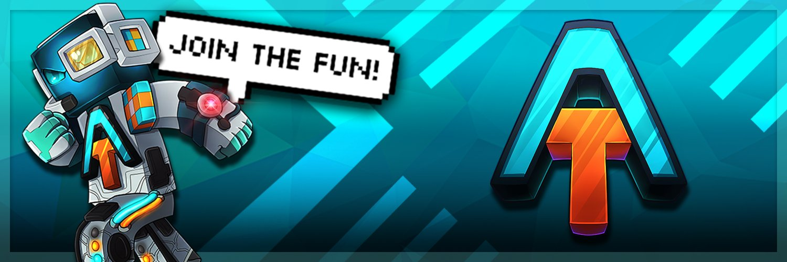

  

	

 

  
Welcome to the official <strong>AvengeTech Network</strong> GitHub Organization!
 
  Here you can find all of the core plugins that ran the network that over <strong>300 THOUSAND</strong> players loved over the years. The 31st of August, 2025 marks the final day in AvengeTech's long life. These plugins are the result of a <strong>DECADE</strong> of dedication to the craft of creating something unique and enjoyable. Some things are a little chaotic internally, but that tends to happen after such a long time of maintainance and growth. Feel free to sample any of our work in your own! 

 

  It has been our absolute pleasure to have had the opportunity to run this network and experience such a massive and loving community. Nothing compares to the roller coaster this network has been. The people met and memories made during our tenure in this community has been a blessing beyond anything we could have ever hoped for. To all future developers dreaming to run a network like this one, chase that dream.  
  Sincerely, The AvengeTech Development Team

